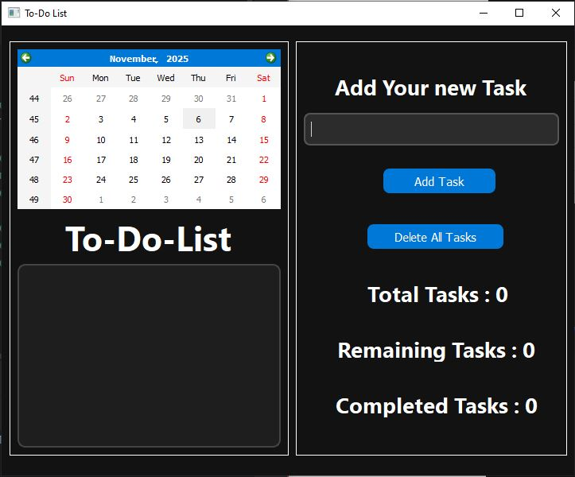

# 📝 PyQt5 To-Do List App

A modern **To-Do List application** built with **PyQt5**, featuring a dark theme, calendar integration, and real-time task statistics.

---

## 🌟 Features

- 🗓️ **Calendar integration** — manage tasks by date  
- ✅ **Check off tasks** when completed  
- 📊 **Live statistics** — total, completed, and remaining  
- 🌙 **Dark theme UI** with custom QSS styling  
- ⚡ Fast and lightweight — built with pure PyQt5  

---

## 🧩 Project Files

| File Name | Description |
|------------|-------------|
| `To-Do-List.py` | Main Python application code |
| `ToDoList-project.ui` | Qt Designer UI file |
| `To-Do-List.JPG` | Screenshot or preview image |

---

## 🖼️ Preview



---

## 🚀 How to Run

### Requirements
- Python 3.x  
- PyQt5 installed

### Installation
```bash
pip install PyQt5
